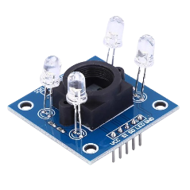

# TCS3200

Este projeto utiliza um **sensor de cor TCS3200/TCS230** conectado ao Arduino para detectar as componentes RGB e a intensidade de branco de uma superfície posicionada em frente ao sensor. Os dados são enviados via monitor serial.

O código configura os pinos de controle do sensor de cor e realiza a leitura sequencial dos valores correspondentes às cores **vermelho**, **verde**, **azul** e **branco**. A leitura é feita por meio da função `pulseIn`, que mede o tempo dos pulsos de saída do sensor. Quanto menor o tempo, maior a intensidade da cor detectada.

## Componentes Necessários

- 1x Arduino Uno (ou similar)
- 1x Sensor de cor TCS3200/TCS230
- Cabos jumper
- Protoboard (opcional)

### Função `detectaCor()`

Esta função configura os filtros do sensor para capturar as diferentes cores:

- **Vermelho:** S2 = LOW, S3 = LOW
- **Sem filtro (branco):** S2 = HIGH, S3 não configurado (mantém o último valor)
- **Azul:** S2 = LOW, S3 = HIGH
- **Verde:** S2 = HIGH, S3 não configurado

Cada leitura é realizada com `pulseIn`, que mede a duração do pulso no pino `OUT`.